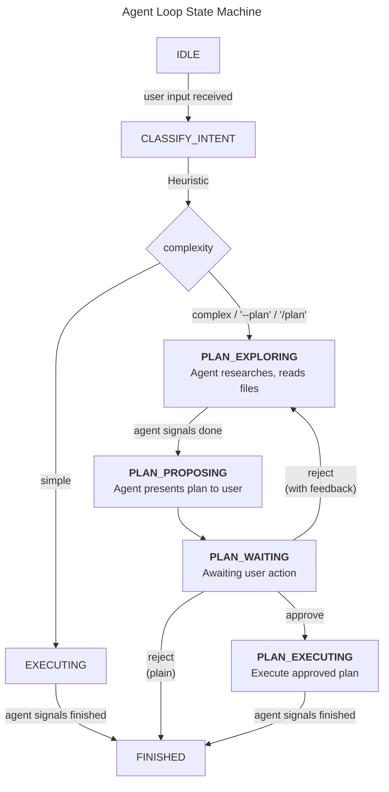

# Toddler — Custom Python Coding Agent Architecture & Development Plan

## Overview

A custom Python CLI coding agent built from scratch for personal coding assistance and code review. No agent frameworks (no Claude Agent SDK, no LangChain) — just Python, the OpenAI-compatible API, and terminal libraries.

**Target**: Python 3.14+, OpenAI-compatible API (DeepSeek), `rich` + `prompt_toolkit` CLI

**API Protocol**: OpenAI-compatible chat completions with tool calling. The LLM provider is designed to work with any OpenAI-compatible endpoint (DeepSeek, OpenAI, local models via vLLM/ollama) by configuring `base_url` and `api_key`.

---

## Core Features

| Feature | Description |
|---------|-------------|
| **Agent Loop** | Async tool-calling loop with streaming, error recovery, stop conditions |
| **Tool System** | Pluggable registry with read/write/shell/git/search tools |
| **Plan Mode** | Manual (`--plan`, `/plan`) or auto-triggered by complexity heuristic |
| **Sessions** | Persistent conversations in SQLite, resumable across restarts |
| **Checkpoints** | Pre-mutation snapshots (git-based + file-copy fallback), rollback support |
| **Streaming** | Real-time token streaming with Rich Live dual-panel display |
| **Context Mgmt** | Token-aware window management, conversation compaction, project mapping |
| **Permissions** | Tiered: READ auto-execute, WRITE confirm, SHELL_DANGEROUS confirm |

---

## Project Structure

```
toddler/
├── __init__.py
├── main.py                     # Entry point, wiring
├── cli/
│   ├── app.py                  # REPL + one-shot CLI
│   ├── commands.py             # Slash commands (/plan, /rollback, /checkpoint, /session)
│   ├── renderer.py             # Rich markdown/syntax rendering
│   └── input_handler.py        # prompt_toolkit input with history/autocomplete
├── agent/
│   ├── loop.py                 # Core agent loop (async generator)
│   ├── state_machine.py        # Plan/Execute mode state machine
│   ├── stop_conditions.py      # Max iter, token budget, end_turn detection
│   └── events.py               # AgentEvent types
├── tools/
│   ├── base.py                 # BaseTool ABC, ToolResult, Permission enum
│   ├── registry.py             # ToolRegistry
│   ├── executor.py             # ToolExecutor (permission gates + checkpoint hook)
│   ├── files.py                # ReadFile, WriteFile, EditFile
│   ├── shell.py                # Shell with sandboxing
│   ├── git.py                  # GitDiff, GitLog, GitStatus, GitCommit, GitBranch
│   └── search.py               # Grep, Glob
├── llm/
│   ├── base.py                 # BaseLLMProvider ABC
│   ├── provider.py             # OpenAICompatibleProvider (SDK, streaming, tool-use)
│   ├── types.py                # Message, ContentBlock, StreamEvent, TokenUsage
│   └── token_counter.py        # tiktoken-based token counting
├── context/
│   ├── window.py               # ContextWindowManager (truncation, compaction trigger)
│   ├── compaction.py           # ConversationCompactor (LLM summarization)
│   ├── project_map.py          # ProjectMapper (structural overview)
│   └── memory.py               # PersistentMemory (user prefs across sessions)
├── session/
│   ├── models.py               # Session, SessionSummary, StoredMessage
│   ├── store.py                # SQLiteStore
│   └── manager.py              # SessionManager (CRUD, auto-title, token tracking)
├── checkpoint/
│   ├── models.py               # Checkpoint, AgentStateSnapshot, RollbackResult
│   ├── snapshot.py             # GitSnapshotter + FileSnapshotter fallback
│   └── manager.py              # CheckpointManager (create, rollback, list, prune)
├── streaming/
│   ├── handler.py              # StreamHandler (SSE → AgentEvent aggregation)
│   └── display.py              # StreamDisplay (Rich Live/Layout panels)
└── config/
    ├── settings.py             # Env vars, CLI args, config file loader
    └── defaults.py             # All default constants
```

---

## Key Data Models

### Message/LLM Types (`llm/types.py`)

```python
@dataclass
class ContentBlock:
    type: Literal["text", "tool_use", "tool_result"]
    text: Optional[str] = None
    tool_id: Optional[str] = None
    tool_name: Optional[str] = None
    tool_input: Optional[dict] = None
    tool_result_content: Optional[str] = None
    is_error: Optional[bool] = None

@dataclass
class Message:
    role: Literal["system", "user", "assistant", "tool"]
    content: list[ContentBlock]
    timestamp: Optional[datetime] = None

@dataclass
class StreamEvent:
    type: Literal["text_delta", "text_done", "tool_use_start",
                  "tool_use_delta", "tool_use_done", "message_start",
                  "message_stop", "error"]
    data: dict

@dataclass
class TokenUsage:
    input_tokens: int = 0
    output_tokens: int = 0
    cache_read_tokens: int = 0
    cache_creation_tokens: int = 0

@dataclass
class LLMResponse:
    messages: list[Message]
    stop_reason: Literal["end_turn", "tool_use", "max_tokens", "stop_sequence"]
    usage: TokenUsage
```

### Agent Events (`agent/events.py`)

```python
@dataclass
class TextDelta(AgentEvent):       # Streaming text token
    text: str

@dataclass
class ToolCallStart(AgentEvent):   # Tool call began streaming
    tool_id: str; tool_name: str; partial_input: dict

@dataclass
class ToolCallDelta(AgentEvent):   # Partial tool input arrived
    tool_id: str; input_delta: dict

@dataclass
class ToolCallEnd(AgentEvent):     # Tool execution complete
    tool_id: str; tool_name: str; input: dict; result: ToolResult

@dataclass
class PlanProposed(AgentEvent):    # Agent presents a plan
    plan: Plan

@dataclass
class AgentPaused(AgentEvent):     # Waiting for user (approval, confirmation)
    prompt: str; choices: list[str]

@dataclass
class AgentFinished(AgentEvent):   # Task complete
    reason: str; usage: TokenUsage

@dataclass
class AgentError(AgentEvent):      # Recoverable error
    message: str; recoverable: bool
```

### Session (`session/models.py`)

```python
@dataclass
class Session:
    id: str                          # UUID4
    created_at: datetime
    updated_at: datetime
    title: Optional[str]
    message_count: int
    total_input_tokens: int
    total_output_tokens: int
    mode: str                        # "execute" or "plan"
    metadata: dict

@dataclass
class SessionSummary:                # Lightweight for listing
    id: str; title: Optional[str]
    created_at: datetime; updated_at: datetime; message_count: int
```

### Checkpoint (`checkpoint/models.py`)

```python
@dataclass
class AgentStateSnapshot:
    mode: str                        # "execute", "plan", "plan_execute"
    iteration: int
    current_plan_json: Optional[str]
    pending_tool_calls_json: Optional[str]

@dataclass
class FileManifestEntry:
    path: str; sha256: str; size: int

@dataclass
class Checkpoint:
    id: str                          # UUID4
    session_id: str
    sequence_num: int
    created_at: datetime
    description: str                 # e.g., "Before EditFile: auth.py line 42"
    tool_name: str
    git_ref: Optional[str]           # Git stash ref if git available
    file_manifest: Optional[list[FileManifestEntry]]
    agent_state: AgentStateSnapshot
    message_index: int

@dataclass
class RollbackResult:
    success: bool
    restored_files: list[str]
    restored_message_index: int
    warnings: list[str]
```

### Plan (`agent/state_machine.py`)

```python
@dataclass
class PlanStep:
    id: str                          # e.g., "step-1"
    description: str                 # "Read auth.py to understand current login flow"
    tool_calls_expected: list[str]   # Tool names likely needed
    files_affected: list[str]
    depends_on: list[str]            # Step IDs that must complete first

@dataclass
class Plan:
    id: str
    title: str                       # "Fix authentication bug in auth.py"
    summary: str                     # 2-3 sentence overview
    steps: list[PlanStep]
    rationale: str
    risks: list[str]
    estimated_files_touched: int
```

---

## Agent Loop State Machine



### Complexity Heuristic (Auto-Trigger Plan Mode)

Triggered when any of these conditions match:
- **Keywords**: `refactor`, `implement`, `redesign`, `restructure`, `migrate`, `overhaul`, `rewrite`, `rearchitect`, `add a feature`, `build a`
- **Length**: Request > 200 words
- **Multi-file indicators**: "across", "multiple files", "and also"
- **Explicit**: `--plan` CLI flag or `/plan` slash command

### System Prompt Stratification

The system prompt is assembled from layers:
1. **Base Persona** — "You are a coding assistant..."
2. **Project Map** — Structural overview of the codebase (always present)
3. **Persistent Memory** — User preferences across sessions (always present)
4. **Mode-Specific Instructions** — Varies by state:
   - `EXECUTING`: "Make changes to accomplish the user's request."
   - `PLAN_EXPLORING`: "RESEARCH only. DO NOT make changes. Explore the codebase, then present a plan."
   - `PLAN_EXECUTING`: "Follow the approved plan steps in order. Report unexpected issues."

---

## Checkpoint Integration

### Pre-Execution Hook in `ToolExecutor.execute()`

```
1. Resolve tool from registry
2. Classify permission level
3. If permission requires confirmation → yield AgentPaused → wait for user
4. If tool is mutating (WRITE, SHELL_DANGEROUS):
   ┌─ Git preferred:
   │  git add -A && git stash create → returns commit hash
   │  (does NOT modify stash stack — uses dangling commit)
   │
   └─ File-copy fallback:
      Copy all tracked files to ~/.toddler/checkpoints/{session_id}/{checkpoint_id}/
      Store sha256 manifest
5. Execute tool
6. On error: checkpoint already exists for recovery
7. Return result (with checkpoint_id)
```

### Rollback

```
1. Load checkpoint from DB
2. Restore files (git stash apply + drop, or file copy)
3. Truncate conversation to message_index
4. Insert rollback note into conversation
```

---

## Streaming Architecture

```
OpenAI SDK (SSE stream via chat.completions.create(stream=True))
        │
        ▼
asyncio.Queue[StreamEvent]          ← OpenAICompatibleProvider normalizes events
        │
        ▼
StreamHandler.process()             ← Aggregates deltas, incremental JSON parsing
        │
        ▼
AgentLoop.run() [async generator]   ← Yields AgentEvent objects
        │
        ▼
CLI App iterates & dispatches       ← Drives Rich Live/Layout
        │
        ├── Upper Panel: Markdown widget (streaming LLM response + partial tool calls)
        └── Lower Panel: Table (tool execution status: [✓] [▶] [ ] [✗])
```

### OpenAI Streaming Model

OpenAI's streaming protocol differs from Anthropic's:
- **Text**: `delta.content` chunks on assistant messages
- **Tool calls**: `delta.tool_calls` array with incremental `function.arguments` JSON fragments
- **Finish reason**: `stop`, `tool_calls`, `length`, `content_filter`
- No separate "message_start" event — the first chunk establishes the message

The `OpenAICompatibleProvider` normalizes these into our internal `StreamEvent` format:
```
openai chunk {delta: {content: "Hel"}}        → StreamEvent(type="text_delta", data={"text": "Hel"})
openai chunk {delta: {tool_calls: [{id: "1", function: {name: "read_file", arguments: "{\"path"}}}]}}
                                              → StreamEvent(type="tool_use_start", ...)
                                              → StreamEvent(type="tool_use_delta", ...)
openai chunk {finish_reason: "tool_calls"}    → StreamEvent(type="tool_use_done", ...)
```

### Incremental JSON Parsing for Tool Calls

```python
class IncrementalJSONParser:
    def feed(self, chunk: str) -> dict:
        self._buffer += chunk
        try:
            self._parsed = json.loads(self._buffer)
        except json.JSONDecodeError:
            pass  # Keep previous successfully-parsed state
        return self._parsed
```

---

## Session Persistence (SQLite)

**Location**: `~/.toddler/sessions.db`

### Schema

```sql
CREATE TABLE sessions (
    id TEXT PRIMARY KEY,
    title TEXT,
    created_at TEXT NOT NULL DEFAULT (datetime('now')),
    updated_at TEXT NOT NULL DEFAULT (datetime('now')),
    message_count INTEGER NOT NULL DEFAULT 0,
    total_input_tokens INTEGER NOT NULL DEFAULT 0,
    total_output_tokens INTEGER NOT NULL DEFAULT 0,
    mode TEXT NOT NULL DEFAULT 'execute',
    metadata_json TEXT NOT NULL DEFAULT '{}'
);

CREATE TABLE messages (
    id INTEGER PRIMARY KEY AUTOINCREMENT,
    session_id TEXT NOT NULL REFERENCES sessions(id) ON DELETE CASCADE,
    sequence_num INTEGER NOT NULL,
    role TEXT NOT NULL,
    content_json TEXT NOT NULL,
    token_count INTEGER NOT NULL DEFAULT 0,
    is_compacted BOOLEAN NOT NULL DEFAULT 0,
    created_at TEXT NOT NULL DEFAULT (datetime('now')),
    UNIQUE(session_id, sequence_num)
);

CREATE TABLE checkpoints (
    id TEXT PRIMARY KEY,
    session_id TEXT NOT NULL REFERENCES sessions(id) ON DELETE CASCADE,
    sequence_num INTEGER NOT NULL,
    created_at TEXT NOT NULL DEFAULT (datetime('now')),
    description TEXT NOT NULL,
    tool_name TEXT,
    git_ref TEXT,
    file_manifest_json TEXT,
    agent_state_json TEXT NOT NULL,
    message_index INTEGER NOT NULL
);

CREATE INDEX idx_messages_session ON messages(session_id, sequence_num);
CREATE INDEX idx_checkpoints_session ON checkpoints(session_id, sequence_num);
```

### Key Operations

- **Auto-title**: Cheap LLM call after first user message (non-blocking)
- **Compaction**: Mark old messages `is_compacted=true`, insert summary message
- **Resume**: `tod --session <id>` reconstructs full conversation from DB
- **Pruning**: Configurable retention for old checkpoints (default: keep latest 50)

---

## Key Interfaces

### BaseTool (`tools/base.py`)

```python
class Permission(Enum):
    READ = "read"
    WRITE = "write"
    SHELL_SAFE = "shell_safe"
    SHELL_DANGEROUS = "shell_dangerous"

class BaseTool(ABC):
    name: str
    description: str
    parameters: dict  # JSON Schema

    @abstractmethod
    async def execute(self, **kwargs) -> ToolResult: ...

    @property
    def permission(self) -> Permission: return Permission.READ

    def to_api_schema(self) -> dict: ...
    def summarize_call(self, **kwargs) -> str: ...
```

### BaseLLMProvider (`llm/base.py`)

```python
class BaseLLMProvider(ABC):
    @property
    @abstractmethod
    def context_window(self) -> int: ...

    @abstractmethod
    async def generate(
        self, messages: list[Message], tools: list[dict], *,
        max_tokens: int = 4096,
        temperature: float = 0.0, stream: bool = True,
    ) -> AsyncIterator[StreamEvent] | LLMResponse: ...

    @abstractmethod
    def count_tokens(self, messages: list[Message]) -> int: ...

    @abstractmethod
    async def generate_compact(self, prompt: str) -> str: ...
```

**Key difference from Anthropic**: System prompts are passed as a `Message` with `role="system"` in the `messages` list, not as a separate parameter. This matches the OpenAI protocol where system messages are first-class messages.

### AgentLoop (`agent/loop.py`)

```python
class AgentLoop:
    async def run(
        self, user_input: str, *,
        force_plan_mode: bool = False,
        max_iterations: int = 50,
        token_budget: int | None = None,
    ) -> AsyncIterator[AgentEvent]: ...

    async def approve_plan(self) -> None: ...
    async def reject_plan(self, feedback: str = "") -> None: ...
    async def approve_tool_call(self, tool_id: str) -> None: ...
```

### SessionManager (`session/manager.py`)

```python
class SessionManager:
    async def create(self, title: str | None = None, mode: str = "execute") -> Session: ...
    async def get(self, session_id: str) -> Session | None: ...
    async def list_all(self) -> list[SessionSummary]: ...
    async def delete(self, session_id: str) -> None: ...
    async def append_message(self, session_id: str, message: Message) -> int: ...
    async def get_messages(self, session_id: str) -> list[Message]: ...
    async def replace_messages(self, session_id: str, messages: list[Message]) -> None: ...
```

### CheckpointManager (`checkpoint/manager.py`)

```python
class CheckpointManager:
    async def create(
        self, description: str, tool_name: str,
        agent_state: AgentStateSnapshot, message_index: int,
    ) -> Checkpoint: ...

    async def rollback_to(self, checkpoint_id: str) -> RollbackResult: ...
    async def list_for_session(self) -> list[Checkpoint]: ...
    async def prune(self, keep_latest: int = 50) -> int: ...
```

---

## Key Design Decisions

| Decision | Rationale |
|----------|-----------|
| **Async throughout** | `asyncio` enables streaming + concurrent tool execution |
| **Edit over Write** | `EditFile` uses exact string replacement — safer, fewer tokens |
| **Tiered permissions** | READ auto-execute, WRITE confirm, SHELL_DANGEROUS always confirm |
| **Flat package layout** | Simpler than `src/` layout for a CLI application |
| **Git-preferred checkpoints** | `git stash create` gives zero-cost deduplicated snapshots |
| **Agent loop as async generator** | Yields AgentEvent objects; CLI iterates and renders |
| **SQLite for persistence** | Serverless, ACID, single file, zero config |

---

## Dependencies

```toml
# pyproject.toml
[project]
name = "toddler"
version = "0.1.0"
description = "Toddler — a personal Python CLI coding agent"
requires-python = ">=3.11"
dependencies = [
    "openai>=1.0.0",
    "rich>=13.0.0",
    "prompt-toolkit>=3.0.0",
    "tiktoken>=0.7.0",
    "python-dotenv>=1.0.0",
]
[project.optional-dependencies]
dev = [
    "pytest>=8.0.0",
    "pytest-asyncio>=0.23.0",
    "pytest-mock>=3.12.0",
    "ruff>=0.5.0",
]
[project.scripts]
tod = "toddler.main:main"
```

---

## Configuration

```python
# Key defaults (config/defaults.py)
DEFAULT_MODEL = "deepseek-v4-pro"
DEFAULT_BASE_URL = "https://api.deepseek.com"  # Set via DEEPSEEK_BASE_URL env var
DEFAULT_MAX_ITERATIONS = 50
DEFAULT_MAX_TOKENS_PER_RESPONSE = 8192
DEFAULT_CONTEXT_WINDOW = 128_000                   # DeepSeek typical; adjust per model
DEFAULT_COMPACTION_THRESHOLD = 0.8                # 80% of context window
AUTO_APPROVE_READ = True
CONFIRM_WRITE = True
CONFIRM_SHELL_DANGEROUS = True
STREAMING_ENABLED = True
SESSION_DIR = "~/.toddler"

# Plan mode triggers
PLAN_MODE_COMPLEXITY_KEYWORDS = [
    "refactor", "implement", "redesign", "restructure",
    "migrate", "overhaul", "rewrite", "rearchitect"
]
PLAN_MODE_MIN_WORDS = 200
```

**Environment variables**:
- `DEEPSEEK_API_KEY` — API key (required)
- `DEEPSEEK_BASE_URL` — Base URL for the API (default: `https://api.deepseek.com`)
- `DEEPSEEK_MODEL` — Model name (default: `deepseek-v4-pro`)
- To use with OpenAI directly: set `OPENAI_API_KEY` and `OPENAI_BASE_URL`
- To use with local models: set base URL to `http://localhost:8000/v1` (vLLM/ollama)

---

## Risks & Mitigations

| Risk | Mitigation |
|------|------------|
| Streaming JSON parsing is fragile | Incremental parser with graceful degradation; show "..." while parsing |
| Context window overflow | Proactive token counting; compaction at 80% threshold; truncation as last resort |
| Git stash conflicts with user state | Use `git stash create` (dangling commit), not `git stash push` |
| Prompt injection from file contents | Wrap all tool outputs in explicit markers before re-feeding to LLM |
| Plan mode produces vague plans | Require structured JSON schema output for plans; validate before accepting |
| Session DB grows unbounded | Message compaction + periodic SQLite VACUUM; configurable retention |
| Async deadlocks | Flat architecture; avoid nested async generators; `asyncio.timeout()` on all I/O |

---

---

# Development Roadmap

## Phase 1: Foundation

**Goal**: Data models, config, tool abstractions — everything else builds on this.

### Step 1.1 — Config Layer

- [x] `config/defaults.py` — All default constants (model, limits, paths, thresholds)
- [x] `config/settings.py` — `Settings` class: env vars, optional config file, CLI arg overlay

### Step 1.2 — LLM Types

- [x] `llm/types.py` — `ContentBlock`, `Message`, `StreamEvent`, `TokenUsage`, `LLMResponse`

### Step 1.3 — Agent Events

- [x] `agent/events.py` — `AgentEvent` base + `TextDelta`, `ToolCallStart/Delta/End`, `PlanProposed`, `AgentPaused`, `AgentFinished`, `AgentError`

### Step 1.4 — Tool Base

- [x] `tools/base.py` — `Permission` enum, `BaseTool` ABC, `ToolResult` dataclass

### Step 1.5 — Package Skeleton

- [x] `pyproject.toml` — Package metadata, dependencies, entry point
- [x] `__init__.py` files for all packages

**Milestone**: ~~All core abstractions defined and importable. Unit tests pass for data model serialization.~~ ✅ Complete — all modules verified importable with Python 3.14.5.

---

## Phase 2: LLM Provider

**Goal**: Working OpenAI-compatible API integration with streaming and tool use.

- [x] `llm/base.py` — `BaseLLMProvider` ABC (provider-agnostic interface)
- [x] `llm/token_counter.py` — tiktoken-based counting with model-specific encodings
- [x] `llm/provider.py` — `OpenAICompatibleProvider`:
    - Uses `openai.AsyncOpenAI` with configurable `base_url` and `api_key`
    - Streaming via `chat.completions.create(stream=True)`
    - Tool calling via the API's native `tools` parameter and `tool_calls` response
    - Message conversion: internal `ContentBlock` format ↔ OpenAI `tools`/`tool_calls` format
    - Error handling: API errors, rate limits (429), context length exceeded
    - Works with DeepSeek, OpenAI, and any compatible endpoint

**Milestone**: ~~Can send messages to DeepSeek and stream responses. Token counting works. Provider is swappable via config.~~ ✅ Complete — all modules verified importable, ruff clean, message conversion tests pass.

---

## Phase 3: Tool System

**Goal**: Complete tool suite for file ops, shell, git, and search.

- [x] `tools/registry.py` — `ToolRegistry` (register/deregister/get/list_schemas)
- [x] `tools/executor.py` — `ToolExecutor` (permission gates, checkpoint hook stubbed for later)
- [x] `tools/files.py` — `ReadFile`, `WriteFile`, `EditFile`
    - `EditFile` validates `old_string` appears exactly once
- [x] `tools/shell.py` — `Shell` with timeout, working dir, env isolation, command classification
- [x] `tools/search.py` — `Grep` (subprocess `grep -rn`), `Glob` (`pathlib.glob`)
- [x] `tools/git.py` — `GitDiff`, `GitLog`, `GitStatus`, `GitCommit`, `GitBranch`

**Milestone**: ~~All tools execute correctly in isolated temp directories. Permission classification works.~~ ✅ Complete — all tools verified with integration tests, ruff clean.

---

## Phase 4: Basic Agent Loop

**Goal**: The core tool-calling loop works end-to-end (non-streaming first).

- [x] `agent/stop_conditions.py` — `StopConditionChecker`
- [x] `agent/loop.py` — `AgentLoop`:
    - Prepare messages → call LLM → parse response
    - If text-only + end_turn → done
    - If tool calls → execute via ToolExecutor → feed results back → loop
    - Permission checking with callback-based user confirmation
    - Error recovery: tool errors fed back to LLM as `is_error=true`

**Milestone**: ~~Agent loop works with mock LLM. Handles text, tool calls, errors, and stop conditions.~~ ✅ Complete — 33 tests pass, ruff clean.

---

## Phase 5: CLI Layer

**Goal**: Interactive REPL and one-shot CLI modes.

- [x] `cli/renderer.py` — `rich.Markdown` rendering, `rich.Syntax` for code blocks
- [x] `cli/input_handler.py` — `prompt_toolkit` with history, multi-line input (Escape+Enter), autocomplete
- [x] `cli/app.py` — `CLIApp`:
    - `--plan`, `--session`, `--new-session`, `--no-stream`, `--list-sessions`
    - REPL loop: prompt → agent.run() → render events → prompt
    - One-shot: single invocation, exit with result
- [x] `main.py` — Entry point wiring all CLI components

**Milestone**: ~~`tod "read auth.py"` works. REPL accepts input and shows agent responses.~~ ✅ Complete — all modules implemented, ruff clean, imports verified.

---

## Phase 6: Streaming

**Goal**: Real-time token-by-token output with Rich Live display.

- [ ] `streaming/handler.py` — `StreamHandler`:
    - Consumes SSE chunks from OpenAI-compatible streaming endpoint
    - Normalizes OpenAI-specific delta chunks (`content`, `tool_calls[].function.arguments`) → internal `StreamEvent`
    - Incremental JSON parser for streaming tool call arguments
    - Aggregates deltas into coherent messages
- [ ] `streaming/display.py` — `StreamDisplay`:
    - Rich `Live` + `Layout` with dual panels
    - Upper: streaming markdown + partial tool call display
    - Lower: tool execution status table

**Milestone**: Full streaming experience — text appears token-by-token, tool calls build incrementally.

---

## Phase 7: Context Management

**Goal**: Smart context window management and persistent user memory.

- [ ] `context/project_map.py` — `ProjectMapper`:
    - Directory tree (gitignore-filtered)
    - Key module import graph summary
    - Config file detection
- [ ] `context/window.py` — `ContextWindowManager`:
    - Token tracking against context limit
    - Compaction trigger at 80% threshold
    - Truncation as last resort
- [ ] `context/compaction.py` — `ConversationCompactor`:
    - Summarize old turns via separate LLM call
    - Replace original messages with summary
- [ ] `context/memory.py` — `PersistentMemory`:
    - `~/.toddler/memory.json` key-value store
    - Injected into system prompt

**Milestone**: Agent handles long conversations. User preferences persist across sessions.

---

## Phase 8: Sessions

**Goal**: Full session persistence — resume conversations across restarts.

- [ ] `session/models.py` — `Session`, `SessionSummary`, `StoredMessage` dataclasses
- [ ] `session/store.py` — `SQLiteStore`:
    - Schema creation + migrations
    - Full CRUD for sessions, messages, checkpoints
- [ ] `session/manager.py` — `SessionManager`:
    - Session lifecycle (create/get/list/delete/update)
    - Message persistence (append/retrieve/replace/compact)
    - Auto-title generation (async, non-blocking)
    - Token usage accumulation

**Milestone**: `tod --session abc123` resumes previous conversation. Sessions list works.

---

## Phase 9: Checkpoints

**Goal**: Pre-mutation snapshots with rollback capability.

- [ ] `checkpoint/models.py` — `Checkpoint`, `AgentStateSnapshot`, `FileManifestEntry`, `RollbackResult`
- [ ] `checkpoint/snapshot.py` — `GitSnapshotter` + `FileSnapshotter`
- [ ] `checkpoint/manager.py` — `CheckpointManager`:
    - `create()` — snapshot before mutating tool
    - `rollback_to()` — restore files + truncate conversation
    - `list_for_session()`, `get()`, `prune()`
- [ ] Wire into `ToolExecutor.execute()`

**Milestone**: `/rollback <checkpoint_id>` restores files and conversation state.

---

## Phase 10: Plan Mode

**Goal**: Full explore → propose → approve → execute workflow.

- [ ] `agent/state_machine.py` — Full `AgentStateMachine`:
    - All 5 states + valid transitions
    - `get_system_prompt_extension()` for mode-specific instructions
    - `should_auto_approve_tool()` for plan execution
    - Plan dataclasses (`Plan`, `PlanStep`)
- [ ] `cli/commands.py` — Slash command parser:
    - `/plan` — enter plan mode
    - `/rollback <id>` — rollback to checkpoint
    - `/checkpoints` — list checkpoints
    - `/session info|list|switch` — session management
    - `/help` — available commands

**Milestone**: Complex requests auto-trigger plan mode. Agent explores, proposes plan, user approves, agent executes.

---

## Phase 11: Integration & Polish

**Goal**: Wired together, tested, production-ready.

- [ ] `main.py` — CLI entry point with full argparse, wiring all components
- [ ] End-to-end tests: mock LLM + real tools + temp directories
- [ ] Error handling hardening: graceful degradation for all failure modes
- [ ] Performance profiling: identify slow paths
- [ ] `README.md` — Usage guide, examples, configuration reference

**Milestone**: `tod "fix the bug in auth.py"` works end-to-end with real DeepSeek API (or any OpenAI-compatible endpoint).

---

## Phase Timeline Summary

```
Phase 1  ██ Foundation              (config, types, tool base)
Phase 2  ██ LLM Provider            (OpenAI-compatible integration)
Phase 3  ███ Tool System            (all tools implemented)
Phase 4  ███ Agent Loop             (core loop working)
Phase 5  ███ CLI Layer              (REPL + one-shot)
Phase 6  ██ Streaming               (real-time display)
Phase 7  ███ Context Management     (window, compaction, memory)
Phase 8  ███ Sessions               (SQLite persistence)
Phase 9  ███ Checkpoints            (snapshots + rollback)
Phase 10 ███ Plan Mode              (state machine + workflow)
Phase 11 ███ Integration            (wiring, tests, polish)
```

### Dependency Graph

```
Phase 1 ──┬── Phase 2 ──┬── Phase 4 ──┬── Phase 5 ──┬── Phase 11
          │             │             │             │
          └── Phase 3 ──┘             ├── Phase 6 ──┤
                                      ├── Phase 7 ──┤
                                      ├── Phase 8 ──┼── Phase 9
                                      └── Phase 10 ─┘  (needs 8 too)
```

- **Phases 2-3** can run in parallel after Phase 1
- **Phases 5-7** can run in parallel after Phase 4
- **Phase 9** depends on both 4 and 8
- **Phase 10** depends on 4, 8, and 9
